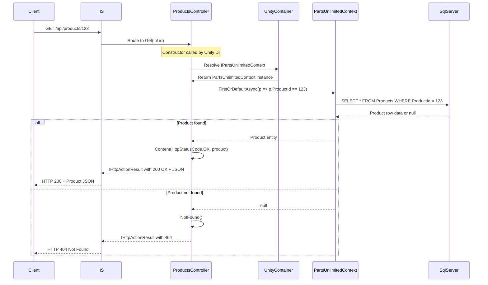
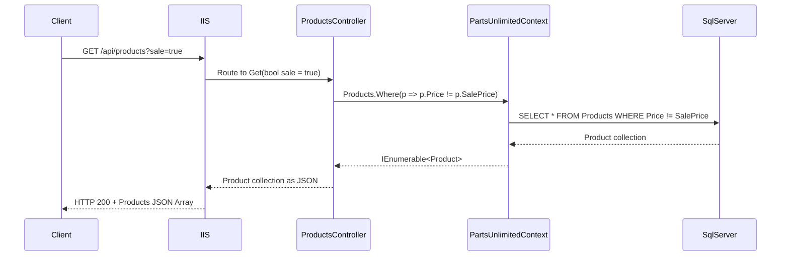
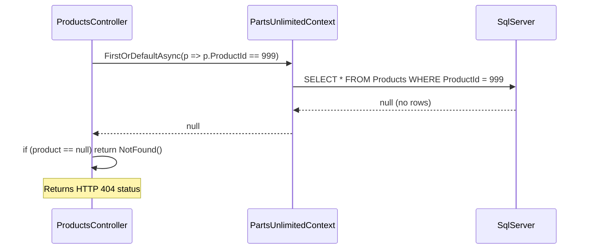
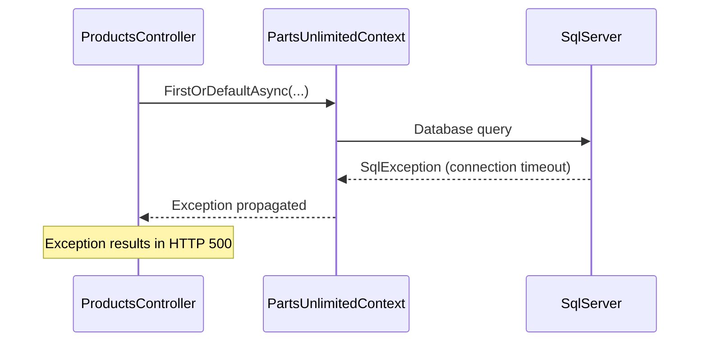
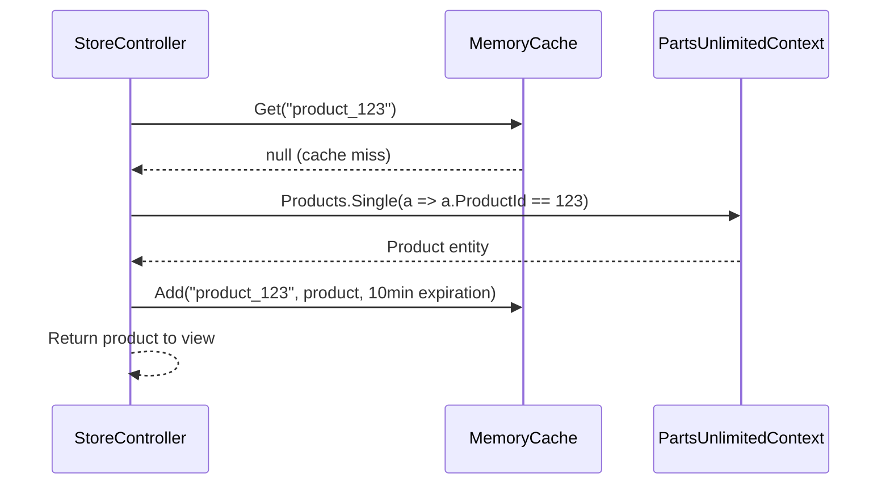

# Sequence Diagram: API Product Retrieval Workflow

This document contains a detailed sequence diagram for the API Product Retrieval workflow in the PartsUnlimited application.

## Workflow: GET /api/products/{id}



## Workflow: GET /api/products (with sale filter)



## Method Call Details

### ProductsController.Get(int id)

**Method Signature:**
```csharp
public async Task<IHttpActionResult> Get(int id)
```

**Parameters:**
- `id` (int): Product identifier from route parameter

**Return Type:**
- `Task<IHttpActionResult>`: Async task containing HTTP action result

**Internal Calls:**
1. `_context.Products.FirstOrDefaultAsync(p => p.ProductId == id)`
2. Conditional: `NotFound()` or `Content(HttpStatusCode.OK, product)`

### ProductsController.Get(bool sale)

**Method Signature:**
```csharp
public IEnumerable<Product> Get(bool sale = false)
```

**Parameters:**
- `sale` (bool): Optional query parameter to filter sale products

**Return Type:**
- `IEnumerable<Product>`: Collection of products

**Internal Calls:**
1. If `sale == false`: `_context.Products` (all products)
2. If `sale == true`: `_context.Products.Where(p => p.Price != p.SalePrice)`

## Error Paths

### Product Not Found (404)


### Database Connection Error (500)


## Performance Considerations

1. **Async Operations**: All database calls use async/await pattern to avoid blocking threads
2. **Query Efficiency**: Simple WHERE clauses with indexed ProductId
3. **No N+1 Problem**: Single query per request
4. **Serialization**: Automatic JSON serialization of Product entities

## Caching Opportunities

While the API endpoints don't implement caching, the MVC controllers in the same application do:



This caching pattern could be applied to the API controllers for improved performance.